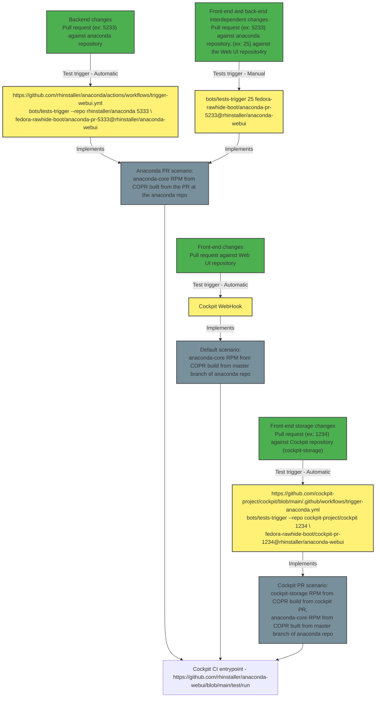

Anaconda CI - Cross-project testing Architecture
------------------------------------------------

```mermaid
graph TD
  style A1 fill:#4CAF50,stroke:#4C4C4C,stroke-width:2px;
  style A2 fill:#4CAF50,stroke:#4C4C4C,stroke-width:2px;
  style A3 fill:#4CAF50,stroke:#4C4C4C,stroke-width:2px;
  style A4 fill:#4CAF50,stroke:#4C4C4C,stroke-width:2px;

  style B1 fill:#FFF176,stroke:#4C4C4C,stroke-width:2px;
  style B2 fill:#FFF176,stroke:#4C4C4C,stroke-width:2px;
  style B3 fill:#FFF176,stroke:#4C4C4C,stroke-width:2px;
  style B4 fill:#FFF176,stroke:#4C4C4C,stroke-width:2px;

  style C1 fill:#78909C,stroke:#4C4C4C,stroke-width:2px;
  style C2 fill:#78909C,stroke:#4C4C4C,stroke-width:2px;
  style C3 fill:#78909C,stroke:#4C4C4C,stroke-width:2px;

A1["Backend changes\nPull request (ex: 5233) against anaconda repository"]
  --> |Test trigger - Automatic| B1["https://github.com/rhinstaller/anaconda/actions/workflows/trigger-webui.yml\nbots/tests-trigger --repo rhinstaller/anaconda 5333 \\nfedora-rawhide-boot/anaconda-pr-5333@rhinstaller/anaconda-webui"]
A2["Front-end changes\nPull request against Web UI repository"]
  -->|Test trigger - Automatic| B2["Cockpit WebHook"]
A3["Front-end storage changes\nPull request (ex: 1234) against Cockpit repository (cockpit-storage)"]
  --> |Test trigger - Automatic| B3["https://github.com/cockpit-project/cockpit/blob/main/.github/workflows/trigger-anaconda.yml\nbots/tests-trigger --repo cockpit-project/cockpit 1234 \\nfedora-rawhide-boot/cockpit-pr-1234@rhinstaller/anaconda-webui"]
A4["Front-end and back-end interdependent changes\nPull request (ex: 5233) against anaconda repository, (ex: 25) against the Web UI reposito4ry"] -->|Tests trigger - Manual| B4["bots/tests-trigger 25 fedora-rawhide-boot/anaconda-pr-5233@rhinstaller/anaconda-webui"]

B1 & B4 -->|Implements| C1["Anaconda PR scenario:\nanaconda-core RPM from COPR built from the PR at the anaconda repo"]
B2 -->|Implements| C2["Default scenario:\nanaconda-core RPM from COPR build from master branch of anaconda repo"]
B3 -->|Implements| C3["Cockpit PR scenario:\ncockpit-storage RPM from COPR build from cockpit PR,\nanaconda-core RPM from COPR built from master branch of anaconda repo"]

C1 ----------> Ζ["Cockpit CI entrypoint - https://github.com/rhinstaller/anaconda-webui/blob/main/test/run"]
C2 ------> Ζ["Cockpit CI entrypoint - https://github.com/rhinstaller/anaconda-webui/blob/main/test/run"]
C3 --> Ζ["Cockpit CI entrypoint - https://github.com/rhinstaller/anaconda-webui/blob/main/test/run"]
```
