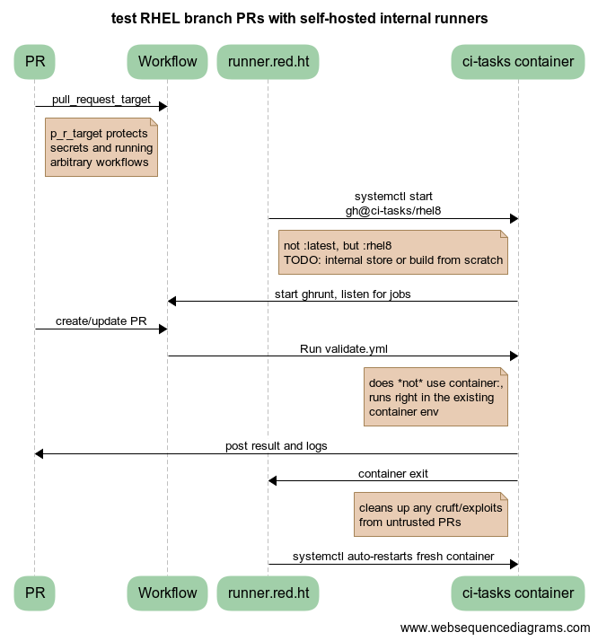

Testing Anaconda
================

This document describes how to run Anaconda tests. Anaconda has various tests
such as unit tests, rpm tests and translation tests.  All the tests will be run
together if you follow the steps below.  For integration tests there is a
separate repository kickstart-tests_ containing also tooling for running the tests.

Run unit tests inside of container
----------------------------------
This is the primary and recommended way to run the tests.

Right now only unit tests are supported by the container, not rpm-tests.
You can use our container image on `quay.io`_
or you can build your own image.
(Optional) to build the container image run::

    make -f Makefile.am anaconda-ci-build

Then you are free to run the tests without dependency installation by
running::

    make -f Makefile.am container-ci

This will run all the tests, including Python test coverage reports. To run
just some tests you can pass parameters which will replace the current one. For
example to run just some unit tests please do this::

    make -f Makefile.am container-ci CI_CMD="make tests-unit-only UNIT_TESTS_PATTERN='test_layout_variant_'"

The ``UNIT_TESTS_PATTERN`` variable is passed to `pytest -k`_. See
the documentation for more info.

To run a different kind of test than unit tests, do this::

    make -f Makefile.am container-ci CI_CMD="make check TESTS='cppcheck/runcppcheck.sh'"

WARNING:

*Just one command* can be passed like this, if `&&` is used then only first
one is run in the container but everything else is started on host!

Logs from the run are stored in the ``test-logs/`` folder; no other files are
modified/touched by the container (it works on an internal copy of the host's
anaconda directory).

Interactively work inside of container
--------------------------------------

For interactively working in the container you can run::

    make -f Makefile.am container-shell

This command will open bash inside the container for you with mounted
current folder at the `/anaconda` path. This is a convenient way
how to run tests but avoid constant call of autotools and build during the
development.

Prepare the environment and build the sources::

    ./autogen.sh
    ./configure
    make

For RHEL 10 use this instead (glade needs to be disabled at build time)::

    ./autogen.sh
    ./configure --disable-glade
    make

Executing the tests can be done with::

    make check

To run a single test do::

    make TESTS=unit_tests/unit_tests.sh check

To run a subset of unit tests do::

    make TESTS=unit_tests/unit_tests.sh UNIT_TESTS_PATTERN='test_layout_variant_' check

The ``UNIT_TESTS_PATTERN`` variable is passed to `pytest -k`_. See
the documentation for more info.

See `tests/Makefile.am` for possible values. Alternatively you can try::

    make ci

This has the advantage of producing Python test coverage for all tests.
In case the *ci* target fails there is also a *coverage-report* target
which can be used to combine the multiple `.coverage` files into one and
produce a human readable report.

Note
----

Please update your container from time to time to have newest dependencies.
To do that, run `podman pull quay.io/rhinstaller/anaconda-ci:master` or build
it locally again.

Run rpm tests inside of container
---------------------------------

First, build the container image for running the test, as it does not yet get
published to any registry::

    make -f Makefile.am anaconda-rpm-build

Then run the test in that container::

    make -f Makefile.am container-rpm-test

Run unit tests with patched pykickstart or other libraries
----------------------------------------------------------

1. Pull the container::

      podman pull quay.io/rhinstaller/anaconda-ci:master

2. Run the container temporary with your required resources (pykickstart in this example)::

      podman run --name=cnt-add --rm -it -v pykickstart/:/pykickstart:z quay.io/rhinstaller/anaconda-ci:master sh

3. Do your required changes in the container (install pykickstart in this example)::

      cd /pykickstart && make install DESTDIR=/

4. Commit the changed container as updated one. **DO NOT exit the running container, run this command in new terminal!**

      podman commit cnt-add quay.io/rhinstaller/anaconda-ci:master

   You can change the ``master`` tag to something else if you don't want to replace the existing one.
   Feel free to exit the running container now.

5. Run other commands for container ci as usual. Don't forget to append ``CI_TAG=<your-tag>`` to
   make calls if you committed the container under a custom tag.

GitHub workflows
----------------

All test and maintenance actions are run by `GitHub workflows`_.  These YAML
files completely describe what steps are required to run some action, what are
its triggers and so on.

Pull request for master:
________________________

Unit and rpm tests are run by the `validate.yml workflow`_.  We use GitHub's
runners for this so we don't have to care about what is executed there.

The workflow rebuilds the ``anaconda-ci`` container if the container files
have changed, otherwise it is pulling the container from `quay.io`_. For more
information see below.

Pull request for RHEL:
______________________

Unit and rpm tests are run by the `validate-rhel-8.yml workflow`_ on (fully
automatically deployed) self-hosted runners in our Upshift instance.

These runners are ``anaconda-ci:rhel8`` containers with all the dependencies in
place so the yml configuration will just execute tests.  You can start runners
locally by running the container and providing GitHub token. That is pretty
valuable in case of workflow testing.  See `github-action-run-once`_ for more
details.

To protect our self-hosted runners, tests only run automatically for
`rhinstaller organization members <https://github.com/orgs/rhinstaller/people>`_.
For external contributors, an organization member needs to approve the test run
by sending a comment starting with ``/tests``.

Running kickstart-tests:
________________________

The `kickstart-tests.yml workflow`_ allows rhinstaller organization members to
run kickstart-tests_ against an anaconda PR (only ``master`` for now). Send a
comment that starts with ``/kickstart-tests <launch options>`` to the pull
request to trigger this. See the `kickstart launch script`_ documentation and
its ``--help`` for details what is supported; the two basic modes are running
a set of individual tests::

   /kickstart-tests keyboard [test2 test3 ...]

or running all tests of one or more given types::

   /kickstart-tests --testtype network,autopart

Container maintenance
---------------------

All active branches run tests in containers. Containers have all the
dependencies installed and the environment prepared to run tests or connect our
GitHub runners (used by RHEL only).

Automatic container build
_________________________

Containers are updated daily by the `container-autoupdate.yml workflow`_
from Anaconda ``master`` repository. Before pushing a new
container, tests are executed on this container to avoid regressions.

Manual container build
______________________

Just go to the `actions tab`_ in the Anaconda repository to the
“Refresh container images“ and press the ``Run workflow`` button on a button on
a particular branch. Usually ``master``, but for testing a change to the
container you can push your branch to the origin repo and run it from there.

Security precautions for testing RHEL
-------------------------------------

Getting into our host/internal network
______________________________________

One of the main precautions is that each container test run has
a limited time and is destroyed after timeout/end of test. That should narrow
what attackers could do or how they can create a backdoor. See the image for
more info:

Another hardening of this is potential issue is that only PRs
approved by/created by users with permission to write are able to run the tests.
To achieve this we have two ways how to start the test.

**PR created by rhinstaller member** -- these are started from the RHEL branch
workflow file by ``pull_request_target`` as usual. This workflow has two
dependent jobs. First will check user privileges, second will run the tests in
case the first one succeeded.

**PR created by external contributors** -- these have to be started by workflow
file `validate-rhel-8.yml workflow`_ from the ``master`` branch
checking all the comments. If comment starts with ``/test`` phrase it will check
the owner of the comment. When everything succeed it will set progress on the pull
request originating the comment and start the tests. This progress is updated
based on the result of the tests. As explained above, the whole implementation
of the workflow is in the ``master`` branch which could be pretty confusing.

Changing workflow file by attacker
__________________________________

Because test description is part of the repository, attackers may change
workflow files by creating PR to do their malicious attack. Because of that we
are using ``pull_request_target`` instead of ``pull_request`` trigger. The main
difference is that ``pull_request_target`` will run your PR tests on the target
branch not on your PR branch. So workflow configuration has to be merged first
to apply workflow changes. This has to be set on all workflow files in all
branches, otherwise attackers could change existing workflow files to use our
runners even for branches where they are not normally used. Unfortunately,
self-hosted runners can’t be bound to the branch, they are bound to the repo.

How can I change the workflow
_____________________________

Due to our hardening it’s not possible to just create PR and see the result
of your change on the PR checks tab. You have to create PR on your fork branch
which has the updated workflow. I would recommend you to create a test
organization for this and avoid creating a new account.

Similar situation works even for workflow to automatically update our containers.
This workflow has ``schedule`` and ``manual_dispatch`` triggers. ``schedule``
triggers are always run on the default branch. For testing updates, always add
``manual_dispatch`` so that you can run them from your branch (on either origin
or your fork).

Test Suite Architecture
------------------------

Anaconda has a complex test suite structure where each top-level directory
represents a different class of tests. They are

- *cppcheck/* - static C/C++ code analysis using the *cppcheck* tool;
- *shellcheck/* - shell code analyzer config;
- *dd_tests/* - Python unit tests for driver disk utilities (utils/dd);
- *unit_tests/dracut_tests/* - Python unit tests for the dracut hooks used to configure the
  installation environment and load Anaconda;
- *gettext/* - sanity tests of files used for translation; Written in Python and
  Bash;
- *glade_tests/* - sanity tests for .glade files. Written in Python;
- *rpm_tests/* - basic RPM sanity test. Checks if anaconda.rpm can be installed in
  a temporary directory without failing dependencies or other RPM issues and checks if
  all files are correctly present in the RPM;
- *lib/* - helper modules used during testing;
- *unit_tests/pyanaconda_tests/* - unit tests for the :mod:`pyanaconda` module;
- *pylint/* - checks the validity of Python source code using the *pocketlint*
  tool;
- *ruff/* - config for fast but not 100% correct linter for Python;
- *unit_tests/regex_tests/* - Python unit tests for regular expressions defined in
  :mod:`pyanaconda.regexes`;

.. NOTE::

    All Python unit tests inherit from the standard :class:`unittest.TestCase`
    class unless specified otherwise!

    Some tests require root privileges and will be skipped if running as regular
    user!

The `cppcheck` test is optional and is automatically skipped if the package is not available.

The tests use the `automake "simple tests" framework <https://www.gnu.org/software/automake/manual/automake.html#Simple-Tests>`.
The launcher scripts are listed under `TESTS` in `tests/Makefile.am`.

.. _kickstart-tests: https://github.com/rhinstaller/kickstart-tests
.. _quay.io: https://quay.io/repository/rhinstaller/anaconda-ci
.. _pytest -k: https://docs.pytest.org/en/7.1.x/reference/reference.html#command-line-flags
.. _GitHub workflows: https://docs.github.com/en/free-pro-team@latest/actions
.. _validate.yml workflow: ../.github/workflows/validate.yml
.. _validate-rhel-8.yml workflow: ../.github/workflows/validate-rhel-8.yml
.. _kickstart-tests.yml workflow: ../.github/workflows/kickstart-tests.yml
.. _kickstart launch script: https://github.com/rhinstaller/kickstart-tests/blob/master/containers/runner/README.md
.. _container-autoupdate.yml workflow: ../.github/workflows/container-autoupdate.yml
.. _actions tab: https://github.com/rhinstaller/anaconda/actions?query=workflow%3A%22Refresh+container+images%22
.. _github-action-run-once: https://github.com/rhinstaller/anaconda/blob/rhel-8/dockerfile/anaconda-ci/github-action-run-once
